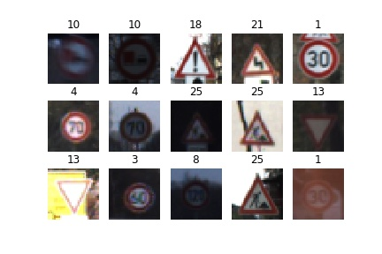
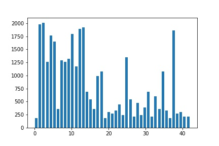
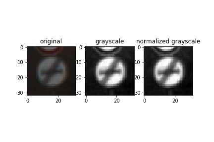
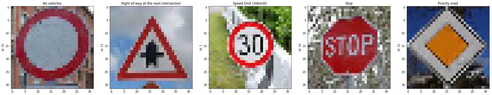
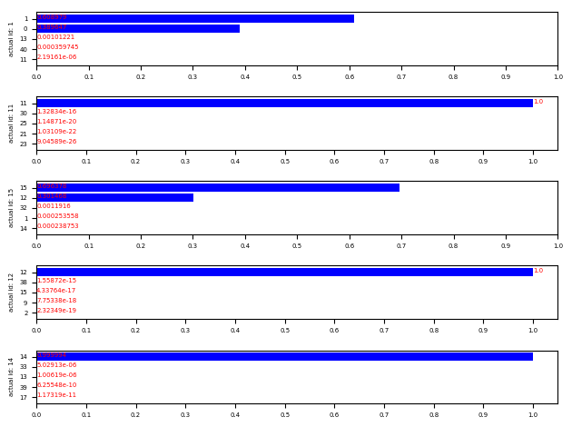

### Data Set Summary & Exploration

#### 1. Provide a basic summary of the data set. In the code, the analysis should be done using python, numpy and/or pandas methods rather than hardcoding results manually.

I used the len() method to calculate summary statistics of the traffic signs data. To calculate number of classes, I used len(set()) to get number of classes in dataset

* Number of training examples = 34799
* Number of training examples = 4410
* Number of testing examples = 12630
* Image data shape = (32, 32, 3)
* Number of classes = 43


#### 2. Include an exploratory visualization of the dataset.

I chose 15 random images from image dataset. Subset of training dataset with labels can be shown below:



Here is an exploratory visualization of the data set. It is a bar chart showing how the frequency of an image in dataset on y axis.



#### 2. Preprocessing of Image Data
Each image in dataset (train, test and validation) has been converted into greyscale by average the R,G,B pixels and then normalizing the entire data set by subtracting pixel value by 128 and then dividing by 128. I have not augmenting the data, since the data provided was enough to prevent overfitting and achieve validation accuracy of 96%. Output after converting to grayscale and normalization can be shown below:



### Design and Test a Model Architecture

#### 2. Describe what your final model architecture looks like including model type, layers, layer sizes, connectivity, etc.) Consider including a diagram and/or table describing the final model.

I used LeNet with dropout. My final model consisted of the following layers:

| Layer         		|     Description	        					| 
|:---------------------:|:---------------------------------------------:| 
| Input         		| 32x32x3 RGB image   							| 
| Convolution 5x5     	| 1x1 stride, valid padding 	                |
| RELU					|												|
| Max pooling	      	| 2x2 stride, valid padding				        |
| Convolution 5x5	    | 1x1 stride, valid padding      				|
| RELU           		|            									|
| Max pooling    		| 2x2 stride, valid padding        			    |
| Flatten		        |        									    |
| Dropout        		| keep_prob=0.7        							|
| Fully connected		|         									    |
| Fully connected		|                							    |
| Fully connected	    |												|
| Softmax				|												|


#### 3. Describe how you trained your model. The discussion can include the type of optimizer, the batch size, number of epochs and any hyperparameters such as learning rate.

To train the model, I used following parameters:
    * learning rate=0.001
    * Probability of keeping a node while using droput = 0.7
    * Batch size = 128
    * Number of Epochs = 50
    * Optimizer = Adam

#### 4. Describe the approach taken for finding a solution and getting the validation set accuracy to be at least 0.93. Include in the discussion the results on the training, validation and test sets and where in the code these were calculated. Your approach may have been an iterative process, in which case, outline the steps you took to get to the final solution and why you chose those steps. Perhaps your solution involved an already well known implementation or architecture. In this case, discuss why you think the architecture is suitable for the current problem.

My final model results were:
* validation set accuracy of 95.8% 
* test set accuracy of 93.8%

Details of architecure:
* I wanted to start with a known architecture to decrease number of iterations to be done. So, I started with basic LeNet architecture. I was able to get accuracy of 89%
* Then, I decreased learning rate to 0.001 and increased number of epochs to 50. I was able to get validation accuracy of 93%
* After that, I added dropout with probability of 0.7. Doing this, I was able to achieve validation accuracy of 96%

### Test a Model on New Images

#### 1. Choose five German traffic signs found on the web and provide them in the report. For each image, discuss what quality or qualities might be difficult to classify.

Here are five German traffic signs that I found on the web:



The first image might be difficult to classify because ...

#### 2. Discuss the model's predictions on these new traffic signs and compare the results to predicting on the test set. At a minimum, discuss what the predictions were, the accuracy on these new predictions, and compare the accuracy to the accuracy on the test set (OPTIONAL: Discuss the results in more detail as described in the "Stand Out Suggestions" part of the rubric).

Here are the results of the prediction:

| Image			                                |     Prediction	        					| 
|:---------------------------------------------:|:---------------------------------------------:| 
| 1            Speed limit (30km/h)      		| 1            Speed limit (30km/h)   			| 
| 11  Right-of-way at the next intersection     | 11  Right-of-way at the next intersection		|
| 15               No vehicles					| 15               No vehicles			     	|
| 12              Priority road	      		    | 12              Priority road   				|
| 14                  Stop			            | 14                   Stop      				|


The model was able to correctly guess 5 of the 5 traffic signs, which gives an accuracy of 100%. This compares favorably to the accuracy on the test set of 93%

#### 3. Describe how certain the model is when predicting on each of the five new images by looking at the softmax probabilities for each prediction. Provide the top 5 softmax probabilities for each image along with the sign type of each probability. (OPTIONAL: as described in the "Stand Out Suggestions" part of the rubric, visualizations can also be provided such as bar charts)

The code for making predictions on my final model is located in the Ipython notebook.

Barchart showing output of top 5 probabilities for all 5 images is as follows:




```python

```
